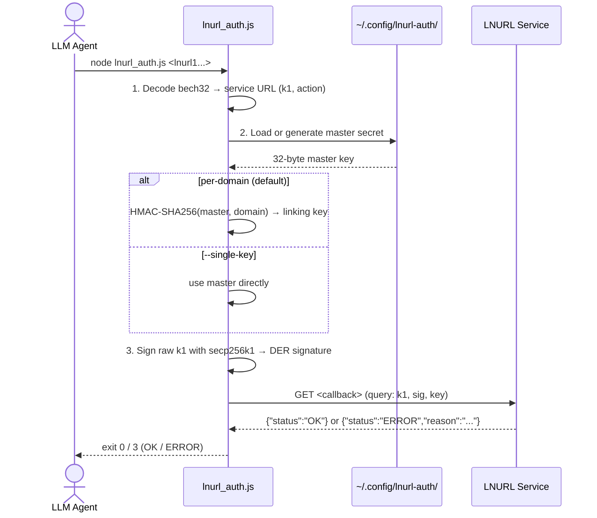
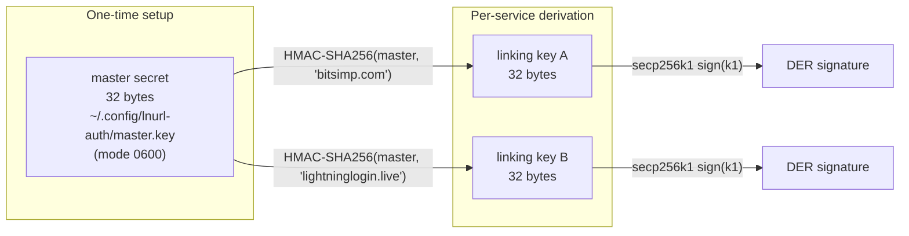
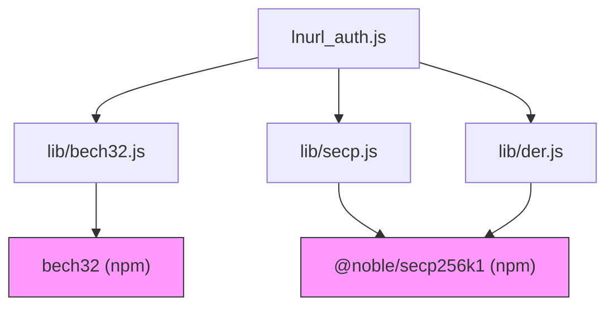

# lnurl-auth — LNURL-auth (LUD-04) signer for LLM coding agents

[](https://github.com/dyegolara/lnurl-auth-agents/actions/workflows/ci.yml) [](https://skills.sh/dyegolara/lnurl-auth-agents)

Authenticate to any LNURL-auth service ("Sign in with Lightning") **entirely
client-side** — no Lightning node, no wallet, no payment, no cost.

Given an `lnurl1...` string (from a QR code, a link, or pasted text), the tool
performs the cryptographic handshake that a Lightning wallet would, returning
the server's `{"status":"OK"}` or `{"status":"ERROR","reason":"..."}`.

Reference: [LUD-04 (auth base spec)](https://github.com/lnurl/luds/blob/luds/04.md)

---

## How it works



### Key derivation architecture



The same service always sees the same key (returning user), but different
services see different keys — privacy-preserving, in the spirit of LUD-05/LUD-13.
Use `--single-key` to share one key across all services.

---

## Requirements

- **Node.js v20.19+** (v22 recommended; required by the current secp256k1 dependency).
- Dependencies are installed via `npm install` and are not bundled with the repository.
  - [`@noble/secp256k1`](https://github.com/paulmillr/noble-secp256k1) (small, zero-dependency ECDSA)
  - [`bech32`](https://github.com/bitcoinjs/bech32) (lnurl decode/encode)
- To install deps: `npm install`.

---

## Quick start

```bash
# Clone the repo
git clone https://github.com/dyegolara/lnurl-auth-agents
cd lnurl-auth-agents

# Authenticate with an lnurl1 string
node lnurl_auth.js <lnurl1...>

# Dry-run (decode, sign, but don't submit)
node lnurl_auth.js <lnurl1...> --dry-run

# Machine-readable output
node lnurl_auth.js <lnurl1...> --json
```

On first use, a 32-byte master secret is generated and saved to
`~/.config/lnurl-auth/master.key` (mode `0600`).

---

## Agent skill installation

`lnurl-auth` follows the [Agent Skills](https://agentskills.io) open standard. The
`SKILL.md` file uses YAML frontmatter (`name`, `description`, `metadata`)
supported by all major LLM coding agents.

For the standard skills CLI, install the repository after it is public:

```bash
npx skills add dyegolara/lnurl-auth-agents --skill lnurl-auth
```

### Claude Code

```bash
mkdir -p ~/.claude/skills/lnurl-auth
cp SKILL.md AGENTS.md lnurl_auth.js ~/.claude/skills/lnurl-auth/
cp -r lib/ ~/.claude/skills/lnurl-auth/
```

### OpenCode

**Global** (all projects):

```bash
mkdir -p ~/.config/opencode/skills/lnurl-auth
cp SKILL.md AGENTS.md lnurl_auth.js ~/.config/opencode/skills/lnurl-auth/
cp -r lib/ ~/.config/opencode/skills/lnurl-auth/
```

**Per-project**:

```bash
mkdir -p .opencode/skills/lnurl-auth
cp SKILL.md AGENTS.md lnurl_auth.js .opencode/skills/lnurl-auth/
cp -r lib/ .opencode/skills/lnurl-auth/
```

### Codex (OpenAI)

```bash
mkdir -p ~/.codex/skills/lnurl-auth
ln -sfn "$(pwd)" ~/.codex/skills/lnurl-auth
```

### OpenClaw

```bash
mkdir -p ~/.claw/skills/lnurl-auth
cp SKILL.md AGENTS.md lnurl_auth.js ~/.claw/skills/lnurl-auth/
cp -r lib/ ~/.claw/skills/lnurl-auth/
```

### Cursor

```bash
mkdir -p ~/.cursor/skills/lnurl-auth
cp SKILL.md AGENTS.md lnurl_auth.js ~/.cursor/skills/lnurl-auth/
cp -r lib/ ~/.cursor/skills/lnurl-auth/
```

### Grok Build (xAI)

```bash
mkdir -p ~/.grok/skills/lnurl-auth
cp SKILL.md AGENTS.md lnurl_auth.js ~/.grok/skills/lnurl-auth/
cp -r lib/ ~/.grok/skills/lnurl-auth/
```

### Hermes Agent (Nous Research)

```bash
mkdir -p ~/.hermes/skills/lnurl-auth
cp SKILL.md AGENTS.md lnurl_auth.js ~/.hermes/skills/lnurl-auth/
cp -r lib/ ~/.hermes/skills/lnurl-auth/
```

### GitHub Copilot

```bash
mkdir -p .github/skills/lnurl-auth
cp SKILL.md AGENTS.md lnurl_auth.js .github/skills/lnurl-auth/
cp -r lib/ .github/skills/lnurl-auth/
```

### MCP (Model Context Protocol)

For maximum compatibility with any MCP-capable agent (Claude Desktop, Cursor,
Continue, Cody, Zed, and many more).

The MCP server is **self-contained**: a single `node mcp/server.js` file with
zero npm dependencies (the crypto libs under `lib/` are vendored). No install
step needed — the server boots straight from a fresh clone, exactly like the
CLI.

```bash
node mcp/server.js
```

**Standalone** — add to your MCP client config (e.g. `claude_desktop_config.json`):

```json
{
  "mcpServers": {
    "lnurl-auth": {
      "command": "node",
      "args": ["/absolute/path/to/lnurl-auth-agents/mcp/server.js"]
    }
  }
}
```

**As a plugin** — this repo includes `.claude-plugin/plugin.json`, `.codex-plugin/plugin.json`,
and `.cursor-plugin/plugin.json` manifests. The `SKILL.md` at the repo root acts as a single
skill. OpenClaw auto-detects Claude-format plugins.

```bash
# Claude Code
claude plugins install ./lnurl-auth-agents --link

# OpenClaw (detects Claude bundle automatically)
openclaw plugins install ./lnurl-auth-agents

# Codex
codex plugins install --link ./lnurl-auth-agents
```

This exposes a single tool `lnurl_auth` that accepts an `lnurl` string and optional
`dry_run`, `single_key`, and `key` parameters — returning the full handshake result
as structured JSON.

---

## CLI options

| Option | Description |
|---|---|
| `--lnurl <str>` | The `lnurl1...` string (or pass it positionally) |
| `--key <hex>` | Use this hex private key as the master secret |
| `--keyfile <path>` | Read the master secret (hex) from a file |
| `--keyout <path>` | Where to persist a generated master secret (default: `~/.config/lnurl-auth/master.key`) |
| `--generate` | Force-generate a new master secret, **overwriting** any existing keyfile |
| `--single-key` | Use one global linking key for all services (no per-domain derivation) |
| `--no-t` | Compatibility option; the callback does not add a `t` parameter |
| `--action <a>` | Assert/override action: `register`, `login`, `link`, or `auth` |
| `--callback <url>` | Override the URL the signature is sent to via GET |
| `--dry-run` | Decode, fetch `k1`, sign — but **do not** submit the callback |
| `--timeout <ms>` | HTTP request timeout in ms (default: 15000) |
| `--json` | Emit machine-readable JSON to stdout |
| `-v`, `--verbose` | Verbose logging |
| `-q`, `--quiet` | Suppress progress logs (stderr) |
| `-h`, `--help` | Show usage |

---

## Programmatic usage

```js
const { decodeLnurl } = require('lnurl-auth/lib/bech32');
const { genPrivateKey, getPublicKey, signCompact, deriveLinkingKey } = require('lnurl-auth/lib/secp');
const { encode } = require('lnurl-auth/lib/der');

const serviceUrl = decodeLnurl(lnurl);
const domain = new URL(serviceUrl).hostname;
const master = genPrivateKey(); // or load from keyfile
const linkingPriv = deriveLinkingKey(master, domain);
const pub = getPublicKey(linkingPriv, true);

const k1 = new URL(serviceUrl).searchParams.get('k1');
const k1Bytes = Buffer.from(k1, 'hex');
const compact = signCompact(k1Bytes, linkingPriv);
const derSigHex = Buffer.from(encode(compact)).toString('hex');

// GET <serviceUrl> with query parameters { k1, sig, key }
```

See [`examples/programmatic.js`](./examples/programmatic.js) for a full example.

---

## Examples

- [`examples/login.sh`](./examples/login.sh) — full dry-run → real login flow.
- [`examples/programmatic.js`](./examples/programmatic.js) — call the library
  functions from your own Node.js script.

---

## Tests

```bash
npm test
```

All tests are **offline**, cost-free, and require no Lightning node.

| Suite | What it tests | Count |
|---|---|---|
| `test/selftest.test.js` | End-to-end roundtrip against a local mock LUD-04 server | 7 tests |
| `test/unit.test.js` | bech32, DER, secp256k1, key derivation, official vectors | 8 tests |

### What the tests cover

**`test/selftest.test.js`** (mock server — 7 tests)

- Happy-path sign → submit → verify roundtrip
- Replay protection (k1 consumed after first use)
- Dry-run does not consume the challenge
- Tampered k1 rejected by server
- Per-domain linking key is stable across invocations
- `--generate` properly overwrites existing keyfile
- Odd-length hex k1 is rejected (no silent corruption)

**`test/unit.test.js`** (offline — 8 tests)

- bech32 roundtrip (random URL)
- bech32 official LUD-01 vector
- DER encode/decode roundtrip
- LUD-04 official signature vector verification
- LUD-04 official vector fails on tampered k1
- sign → DER → verify full roundtrip with fresh key
- Per-domain HMAC key derivation (deterministic + isolated)
- Compressed pubkey is exactly 33 bytes

---

## Real-world verification

| Service | Result | Response |
|---|---|---|
| [bitsimp.com](https://bitsimp.com) | Success | `HTTP 200 {"status":"OK","success":true}` |
| [lightninglogin.live](https://lightninglogin.live) | Success | `HTTP 200 {"status":"OK"}` |

---

## Dependencies



Both npm packages are pure JavaScript and **vendored** in `node_modules/` —
no native compilation, no network at runtime.

---

## Limitations

- This performs the cryptographic login handshake; whether the *account* is
  created/logged-in depends on the remote service recognising the derived key.
- The default linking key is derived from a **local** master secret; it is
  **not** the same identity a user's phone wallet would use (those follow
  LUD-05 BIP32 / LUD-13 from the wallet seed). That is fine for agent auth.
- Submitting a login requires network egress to the service's callback URL
  (the only external HTTP call; still no payment, no node).
- Only short-form DER encoding is supported (valid for all secp256k1 signatures).

---

## Contributing

Contributions are welcome! See [CONTRIBUTING.md](./CONTRIBUTING.md) for guidelines.

---

## License

MIT — see [LICENSE](./LICENSE)
